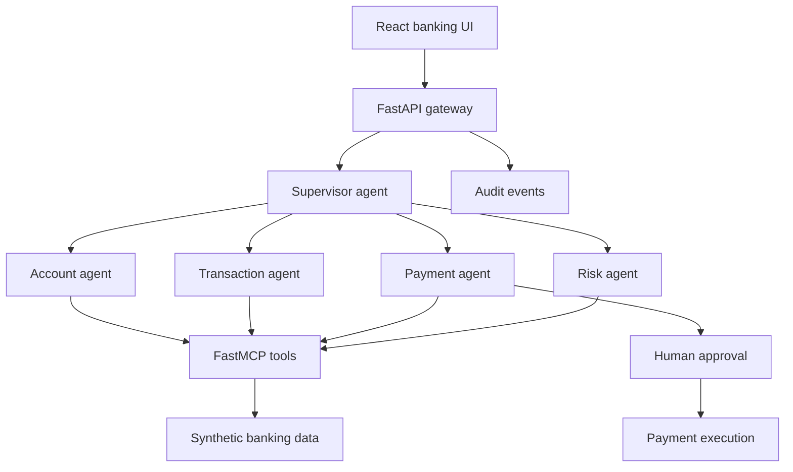

# Enterprise Banking Multi-Agent Assistant

[](https://www.python.org/)
[](https://fastapi.tiangolo.com/)
[](https://react.dev/)
[](LICENSE)

A portfolio-ready banking assistant that demonstrates supervisor-based
multi-agent routing, MCP-compatible tools, payment guardrails, human approval,
auditability, optional Azure AI integrations, and a responsive React interface.

The default demo runs without cloud credentials using synthetic banking data.
Azure OpenAI, Microsoft Agent Framework, and Azure AI Document Intelligence can
be enabled when the corresponding environment values are configured.

## What it demonstrates

- Supervisor agent routes conversations to account, transaction, payment, or
  risk specialists.
- FastMCP exposes governed account, transaction, beneficiary, and payment tools.
- Payment execution uses a two-step draft and human-approval workflow.
- Policy guard blocks high-value transfers and duplicate invoice payments.
- Audit events record routing, tool use, approvals, rejections, and execution.
- Optional Azure Document Intelligence extracts invoice fields for review.
- Optional Microsoft Agent Framework adapter connects Azure OpenAI agents to
  the MCP server.
- FastAPI and React provide a practical end-to-end demonstration.

## Architecture



## Agent responsibilities

| Agent | Responsibility | Safety behavior |
|---|---|---|
| Supervisor | Classifies intent and delegates the request | Rejects unsupported banking actions |
| Account | Balances, cards, payment methods, beneficiaries | Masks account and card identifiers |
| Transaction | Recent activity, merchant search, category summaries | Uses read-only tools |
| Payment | Builds payment drafts and checks required details | Never executes without explicit approval |
| Risk | Detects duplicate invoices and high-risk transfer patterns | Blocks or escalates risky requests |

## Quick start

### Requirements

- Python 3.11+
- [`uv`](https://docs.astral.sh/uv/)
- Node.js 20+

### Run the API

```bash
git clone https://github.com/ashokchinthak6/enterprise-banking-multi-agent-assistant.git
cd enterprise-banking-multi-agent-assistant
cp .env.example .env
cd backend
uv sync --all-extras --all-groups
uv run uvicorn app.main:app --reload --port 8000
```

API documentation is available at `http://localhost:8000/docs`.

### Run the React interface

In another terminal:

```bash
cd frontend
npm install
npm run dev
```

Open `http://localhost:5173`.

### Run the MCP server

```bash
cd backend
uv run python -m app.mcp_server
```

The streamable HTTP MCP endpoint is available at `http://localhost:8001/mcp`.

## Example prompts

```text
Show my account balance and available payment methods.
```

```text
Summarize my last ten transactions and spending by category.
```

```text
Pay Contoso Utilities $125.40 for invoice INV-2048.
```

The third request creates a payment draft. The user must review the payee,
invoice, funding method, and amount before providing the approval token.

## Azure configuration

The local demo does not require Azure. To enable cloud-backed agent behavior:

1. Configure `AZURE_OPENAI_ENDPOINT` and `AZURE_OPENAI_DEPLOYMENT`.
2. Use `az login` for `DefaultAzureCredential` authentication.
3. Configure the Document Intelligence endpoint to enable invoice extraction.
4. Run the MCP service before starting a Microsoft Agent Framework workflow.

Never commit `.env`, access tokens, account data, or production credentials.

## Testing

```bash
cd backend
uv run ruff check .
uv run pytest
```

The tests validate intent routing, account masking, transaction summaries,
payment approvals, high-value blocks, duplicate invoice protection, audit
events, and FastAPI endpoints.

## Important disclaimer

This project uses synthetic data and is for demonstration and learning only.
It is not connected to a real bank, does not provide financial advice, and
must not be used to execute real financial transactions.

## Attribution

This compact implementation is inspired by Microsoft's MIT-licensed
[Multi-Agent Banking Assistant](https://github.com/Azure-Samples/agent-openai-python-banking-assistant).
See [NOTICE](NOTICE) for the upstream attribution and modification summary.

## Author

Customized and extended by [Ashok Chinthakindi](https://github.com/ashokchinthak6).
